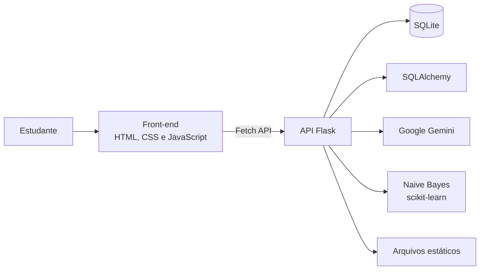

<div align="center">


# Study 4Life

### Aprender, evoluir e manter o foco em um só lugar.

Plataforma educacional gamificada voltada a estudantes do Ensino Médio, com conteúdos por matéria, quizzes, missões, ranking, modo foco e assistência por Inteligência Artificial.

<p>
  <a href="https://study-4life-production-c3a4.up.railway.app">
    
  </a>
  <a href="https://github.com/matheusdeavila2008-bot/Study-4Life/issues/new">
    
  </a>
</p>

<p>
  
  
  
  
  
  
  <a href="./public/LICENSE">
    
  </a>
</p>

[Sobre](#-sobre-o-projeto) •
[Funcionalidades](#-funcionalidades) •
[Tecnologias](#-tecnologias) •
[Instalação](#-como-executar-localmente) •
[API](#-rotas-da-api) •
[Autores](#-autores)

</div>

---

## 📖 Sobre o projeto

O **Study 4Life** foi criado para tornar a rotina de estudos mais organizada, interativa e motivadora. A plataforma reúne materiais de diferentes matérias e combina aprendizagem com recursos de gamificação, permitindo que o estudante acompanhe sua evolução por meio de **XP, níveis, missões, sequências de acesso e ranking**.

Além dos recursos tradicionais de estudo, o projeto possui dois assistentes com propostas diferentes:

- **StudyChat.IA:** assistente educacional integrado ao **Google Gemini**, utilizado para esclarecer dúvidas sobre conteúdos escolares.
- **Central de Ajuda:** chatbot local treinado com **Naive Bayes**, responsável por responder perguntas frequentes sobre o funcionamento da própria plataforma.

> [!NOTE]
> O projeto está em fase de desenvolvimento. O fluxo principal do aluno já está integrado ao back-end, enquanto algumas áreas, como o acesso de professores e a recuperação de senha, ainda estão sendo aprimoradas.

## 🌟 Diferenciais

<table>
  <tr>
    <td align="center" width="25%">
      <strong>📚 Aprendizagem</strong><br><br>
      Conteúdos, perguntas e quizzes organizados por matéria.
    </td>
    <td align="center" width="25%">
      <strong>🎮 Gamificação</strong><br><br>
      XP, níveis, missões, estrelas, progresso e ranking.
    </td>
    <td align="center" width="25%">
      <strong>🤖 Inteligência Artificial</strong><br><br>
      Gemini para estudos e Naive Bayes para suporte interno.
    </td>
    <td align="center" width="25%">
      <strong>⏱️ Produtividade</strong><br><br>
      Modo foco, cronômetro e acompanhamento do tempo estudado.
    </td>
  </tr>
</table>

## ✨ Funcionalidades

### ✅ Recursos implementados

- Cadastro e autenticação de estudantes.
- Senhas armazenadas com hash utilizando Werkzeug.
- Catálogo educacional dividido em:
  - Matemática;
  - Português;
  - Biologia;
  - Química;
  - Física;
  - Ciências;
  - Geografia;
  - História;
  - Filosofia;
  - Redação;
  - Línguas;
  - Tecnologia;
  - Outros conteúdos.
- Banco de perguntas e quizzes específicos por matéria.
- Registro de quizzes concluídos, XP recebido e quantidade de estrelas.
- Sistema de XP, níveis e ranks de evolução.
- Missões diárias geradas para cada estudante.
- Conclusão manual ou automática de missões por eventos da plataforma.
- Ranking geral baseado na pontuação dos usuários.
- Perfil com avatar, progresso, sequência de acessos e tempo estudado.
- Modo Foco com iniciar, pausar e reiniciar o cronômetro.
- Organização de conteúdos em favoritos, histórico e concluídos.
- Histórico de conversas do StudyChat.IA.
- Assistente educacional com **Google Gemini 2.5 Flash**.
- Central de Ajuda com **CountVectorizer + Multinomial Naive Bayes**.

### 🚧 Em desenvolvimento

- Integração completa do cadastro e login de professores.
- Validação de documentos enviados por docentes.
- Recuperação e redefinição de senha por e-mail.
- Persistência completa de favoritos e histórico no back-end.
- Melhorias de responsividade, acessibilidade e experiência mobile.
- Painel administrativo para gerenciamento de usuários e conteúdos.

## 🧭 Fluxo do estudante

1. O estudante cria uma conta e realiza o login.
2. Acessa materiais organizados por área de conhecimento.
3. Responde quizzes e recebe XP de acordo com seu desempenho.
4. Cumpre missões para avançar de nível e aumentar sua pontuação.
5. Acompanha seu progresso no perfil e compara sua posição no ranking.
6. Utiliza o Modo Foco para organizar o tempo de estudo.
7. Consulta o StudyChat.IA ou a Central de Ajuda quando precisar de suporte.

## 🛠️ Tecnologias

### Front-end

| Tecnologia | Utilização |
|---|---|
| HTML5 | Estrutura das páginas |
| CSS3 | Estilização, layouts e responsividade |
| JavaScript | Interações, quizzes, cronômetro e consumo da API |
| Fetch API | Comunicação entre front-end e back-end |

### Back-end e dados

| Tecnologia | Utilização |
|---|---|
| Python | Linguagem principal do servidor |
| Flask | Servidor web, páginas estáticas e API REST |
| Flask-CORS | Configuração de requisições entre origens |
| SQLAlchemy | ORM e comunicação com o banco de dados |
| SQLite | Persistência dos dados da aplicação |
| Werkzeug | Geração e verificação de hash das senhas |
| python-dotenv | Carregamento de variáveis de ambiente |
| Gunicorn | Servidor WSGI utilizado em produção |

### Inteligência Artificial e Machine Learning

| Tecnologia | Utilização |
|---|---|
| Google Gemini | Geração das respostas do StudyChat.IA |
| google-genai | Integração do Flask com a API do Gemini |
| scikit-learn | Construção do chatbot da Central de Ajuda |
| CountVectorizer | Transformação das perguntas em vetores |
| MultinomialNB | Classificação das dúvidas frequentes |

### Deploy

- **Railway:** hospedagem da aplicação Flask e do front-end estático.
- **GitHub:** versionamento do código e colaboração entre os autores.

## 🏗️ Arquitetura da aplicação



O Flask centraliza a aplicação: disponibiliza as páginas da pasta `public/`, processa as rotas da API, acessa o SQLite por meio do SQLAlchemy e realiza as integrações de IA.

## 📂 Estrutura do projeto

<details>
<summary><strong>Clique para visualizar a estrutura principal</strong></summary>

```text
Study-4Life/
├── back-end/
│   ├── app.py                  # Aplicação Flask e rotas da API
│   ├── banco.py                # Modelos, persistência e regras de negócio
│   ├── machine_learning.py     # Chatbot da Central de Ajuda
│   ├── requirements.txt        # Dependências do back-end
│   └── study4life.db           # Banco SQLite para desenvolvimento
│
├── public/
│   ├── index.html              # Tela inicial de escolha de acesso
│   ├── indexHome.html          # Página principal do estudante
│   ├── indexBiblioteca.html    # Biblioteca de conteúdos
│   ├── indexQuiz.html          # Mapa geral dos quizzes
│   ├── indexPerfil.html        # Perfil e missões
│   ├── indexRanking.html       # Ranking dos estudantes
│   ├── indexFoco.html          # Modo foco
│   ├── indexChatIA.html        # StudyChat.IA
│   ├── indexSuporte.html       # Central de Ajuda
│   ├── indexCatalogo*.html     # Catálogos por matéria
│   ├── indexPerguntas*.html    # Perguntas por matéria
│   ├── quiz*.html              # Quizzes por matéria
│   ├── script*.js              # Lógica do front-end
│   ├── style*.css              # Estilos das páginas
│   └── imagens, ícones e áudio
│
├── .gitignore
├── index.html                  # Redirecionamento para public/index.html
└── README.md
```

</details>

## 🚀 Como executar localmente

### Pré-requisitos

- Python 3.10 ou superior;
- Git instalado;
- Chave de API do Google Gemini.

### 1. Clone o repositório

```bash
git clone https://github.com/matheusdeavila2008-bot/Study-4Life.git
cd Study-4Life
```

### 2. Crie o ambiente virtual

```bash
python -m venv .venv
```

**Windows — Prompt de Comando:**

```bash
.venv\Scripts\activate
```

**Windows — PowerShell:**

```powershell
.\.venv\Scripts\Activate.ps1
```

**Linux ou macOS:**

```bash
source .venv/bin/activate
```

### 3. Instale as dependências

```bash
pip install -r back-end/requirements.txt
```

### 4. Configure a API do Gemini

Crie um arquivo chamado `.env` dentro da pasta `back-end/`:

```env
GEMINI_API_KEY=sua_chave_do_google_gemini
```

### 5. Inicie a aplicação

```bash
cd back-end
python app.py
```

Abra no navegador:

```text
http://127.0.0.1:5000
```

O banco SQLite e as tabelas necessárias são inicializados automaticamente pelo SQLAlchemy.

## 🔐 Variáveis de ambiente

| Variável | Obrigatória | Descrição |
|---|:---:|---|
| `GEMINI_API_KEY` | Sim | Chave utilizada pelo StudyChat.IA |
| `PORT` | Não | Porta do servidor; em produção é definida pela hospedagem |

> [!IMPORTANT]
> Nunca publique o arquivo `.env`, chaves de API ou bancos de dados contendo informações reais de usuários. Mantenha esses arquivos no `.gitignore` e utilize dados fictícios durante o desenvolvimento.

## 📡 Rotas da API

<details>
<summary><strong>Clique para visualizar as principais rotas</strong></summary>

| Método | Rota | Descrição |
|:---:|---|---|
| `POST` | `/cadastro` | Cadastra um estudante |
| `POST` | `/login` | Autentica um estudante |
| `GET` | `/perfil/<usuario_id>` | Retorna os dados do perfil |
| `POST` | `/tempo` | Registra tempo de estudo |
| `POST` | `/quiz/xp` | Registra XP em quizzes antigos |
| `GET` | `/quiz/progresso/<usuario_id>` | Retorna o progresso dos mapas de quiz |
| `POST` | `/quiz/concluir` | Conclui um quiz com XP e estrelas |
| `POST` | `/missao/xp` | Adiciona XP de missão manualmente |
| `GET` | `/missoes/<usuario_id>` | Lista as missões diárias |
| `POST` | `/missoes/concluir` | Conclui uma missão manualmente |
| `POST` | `/missao/evento` | Conclui missões por eventos automáticos |
| `POST` | `/avatar` | Atualiza o avatar do estudante |
| `GET` | `/ranking` | Retorna o ranking geral |
| `POST` | `/ajuda` | Envia uma dúvida para a Central de Ajuda |
| `POST` | `/chat-ia` | Envia uma pergunta ao StudyChat.IA |
| `GET` | `/historico-chat-ia/<usuario_id>` | Retorna o histórico do StudyChat.IA |

</details>

## 🌐 Aplicação online

A versão publicada pode ser acessada em:

### [study-4life-production-c3a4.up.railway.app](https://study-4life-production-c3a4.up.railway.app)

> Alguns recursos dependem da disponibilidade do serviço de hospedagem e da cota configurada para a API do Gemini.

## 🤝 Como contribuir

1. Faça um fork deste repositório.
2. Crie uma branch para sua alteração:

```bash
git checkout -b feature/minha-melhoria
```

3. Faça o commit:

```bash
git commit -m "feat: adiciona minha melhoria"
```

4. Envie a branch:

```bash
git push origin feature/minha-melhoria
```

5. Abra um Pull Request explicando o objetivo da alteração.

## 🗺️ Próximos passos

- [ ] Finalizar o fluxo de professores.
- [ ] Implementar recuperação de senha por e-mail.
- [ ] Criar painel administrativo.
- [ ] Migrar dados de produção para um banco persistente gerenciado.
- [ ] Adicionar testes automatizados para as rotas da API.
- [ ] Melhorar acessibilidade e navegação por teclado.
- [ ] Criar documentação dos formatos de requisição e resposta da API.

## 📄 Licença

Este projeto está disponível sob a licença **MIT**. Consulte o arquivo [`public/LICENSE`](./public/LICENSE) para mais informações.

## 👥 Autores

<table>
  <tr>
    <td align="center">
      <a href="https://github.com/matheusdeavila2008-bot">
        <br>
        <strong>Matheus D'Ávila</strong>
      </a>
    </td>
    <td align="center">
      <a href="https://github.com/Gabrielrlp">
        <br>
        <strong>Gabriel Rodrigues</strong>
      </a>
    </td>
  </tr>
</table>

---

<div align="center">

Feito com 💚 para transformar estudo em evolução.

**Study 4Life — estude hoje, evolua para a vida.**

</div>
